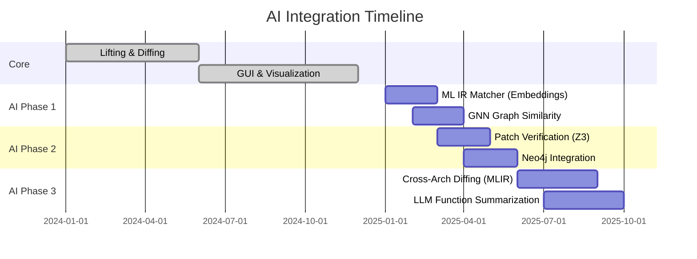

# Project Vision: Next-Generation Windows Kernel Driver Analysis 🚀

## 1. The Problem with BinDiff & Standard Tools
Traditional binary diffing tools (BinDiff, Diaphora) rely heavily on:
*   **Syntax Matching**: Graph isomorphism and mnemonic hashing.
*   **Limitations**:
    *   **Logic Blindness**: They report 95% similarity but miss the 1% critical security fix (e.g., `if (size > 0x1000)`).
    *   **Compiler Noise**: Optimization flags shuffle instructions, breaking syntax-based matches even when logic is identical.

## 2. The Solution: Semantic-First Analysis
We are building a tool that understands **Meaning (Semantics)** over **Form (Syntax)**.

### Core Pillars
1.  **Semantic Understanding**: Using **VEX IR** and **angr** to lift code to an abstract representation, normalizing compiler artifacts.
2.  **Logic Verification**: Using **Z3 SMT Solver** to mathematically prove if two functions are equivalent or if a specific constraint (Silent Patch) has been added.
3.  **Driver-Aware**: Native understanding of Windows Kernel structures (`DriverEntry`, `IOCTL`, `IRP`) to automate attack surface mapping.
4.  **Pwn Capabilities**: Beyond analysis—**Automated Exploit Generation (AEG)** and **Double-Fetch Detection** to directly aid offensive security research.

---

## 3. Architecture Modules

| Module | Technology | Expected Output |
|--------|------------|-----------------|
| **Lifting** | angr + pyvex | VEX IR (Canonical Form) |
| **Driver Context** | angr + symbolic state tracking | IOCTL Mapping |
| **Semantic Diffing** | Diaphora heuristics + Z3 | Logic Diff Report |
| **Visualization** | Cytoscape.js + Flask API | Interactive Graph |
| **Patch Verification** | Z3 + Property Testing | Equivalence Proof |
| **ML IR Matcher** | Sentence Transformers + FAISS | Vector Similarity |

---

## 4. AI Integration Roadmap 🤖

### Phase 6: Patch Verification (Automated)
- **Goal**: Automatically verify that a patch does NOT change existing logic unintentionally.
- **Method**: Z3 equivalence checking + Property-based testing.
- **Output**: "This patch is SAFE" or "WARNING: Logic change detected in X."

### Machine Learning IR Matcher
- **Technology**: Sentence Transformers / CodeBERT / IR2Vec
- **Function**: Generate embedding vectors for each function's IR.
- **Benefit**: 10-100x faster similarity matching than symbolic execution.
```
Function A IR → [Embedding Model] → Vector (768-dim)
Function B IR → [Embedding Model] → Vector (768-dim)
Similarity = Cosine(VecA, VecB)
```

### Graph Neural Network (GNN) Similarity
- **Technology**: Graph Attention Networks (GAT) / GraphSAGE
- **Function**: Embed entire CFG/CallGraph as a single vector.
- **Benefit**: Capture structural + semantic similarity in one embedding.
```
CFG (Nodes + Edges) → [GNN Encoder] → Graph Embedding → Similarity Score
```

### Cross-Architecture Diffing (MLIR/Triton)
- **Technology**: OpenAI Triton or LLVM MLIR
- **Function**: Normalize IR to an even higher abstraction layer.
- **Benefit**: Compare ARM vs x86 drivers with semantic accuracy.
```
x86 Binary → VEX IR → MLIR → [Compare] ← MLIR ← VEX IR ← ARM Binary
```

### Neo4j Graph Export
- **Technology**: Neo4j + Cypher Query Language
- **Function**: Export IR + semantic diff data to Neo4j database.
- **Benefit**: Complex graph queries for logic diff analysis.
```cypher
MATCH (a:Function)-[:CALLS]->(b:Function)
WHERE a.is_patched = true
RETURN a, b
```

---

## 5. Future Roadmap



---

This tool is designed to be the **"BinDiff Killer"** for the modern security researcher, powered by cutting-edge AI/ML techniques.
